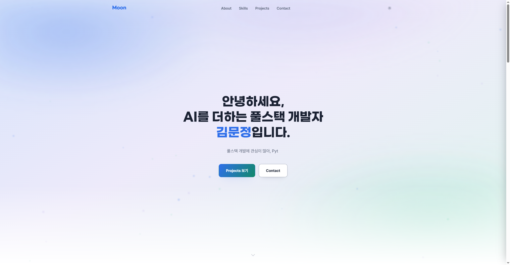
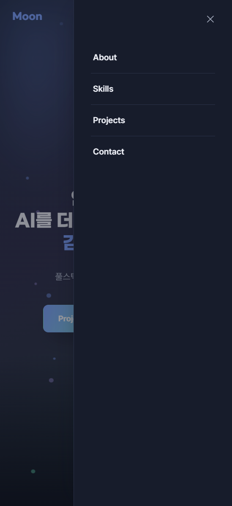
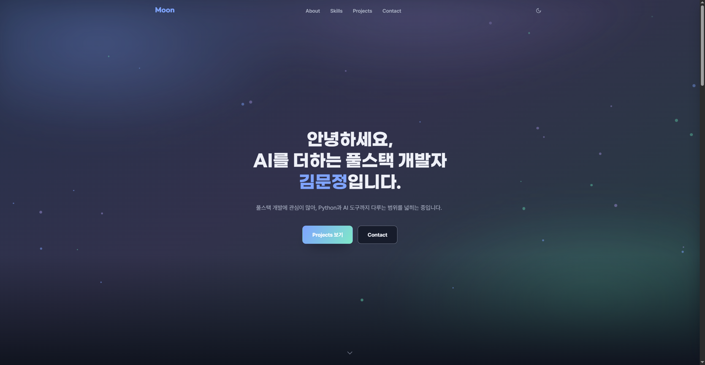

# 🌙 김문정 — Build Log

**미션**: B1-1 · 나를 소개하는 웹페이지 처음부터 만들기
외부 라이브러리 없이 순수 HTML/CSS/JavaScript로 완성한 반응형 개인 포트폴리오입니다.

## 개발 환경
- 에디터: VS Code + Live Server 확장
- 언어: HTML5 / CSS3 / Vanilla JavaScript (ES6+)
- 외부 라이브러리: 사용하지 않음 (`EmailJS` SDK는 보너스 "폼 실제 전송"에서만 예외적으로 사용)
- 웹폰트: Gmarket Sans(제목), Pretendard(본문) — jsDelivr CDN
- 배포: GitHub Pages
- 권장 브라우저: 최신 Chrome

## 배포 URL
- GitHub 저장소: https://github.com/segretoo/codyssey-b1-1
- 배포 사이트: https://segretoo.github.io/codyssey-b1-1/

## 스크린샷
| Desktop | Mobile | Dark mode |
|---|---|---|
|  |  |  |

## 프로젝트 개요
HTML/CSS/JavaScript는 브라우저가 이해하는 유일한 언어이고, React 같은 프레임워크도 결국 이 세 가지로 변환되어 동작합니다. 이 프로젝트는 그 기초를 직접 손으로 확인하기 위해, 프레임워크나 라이브러리 없이 "사용자 이벤트 → 상태 변경 → 화면 업데이트"가 이어지는 흐름을 처음부터 끝까지 구현한 반응형 포트폴리오입니다.

GitHub API를 연동해 실제 서비스에서 자주 등장하는 로딩 · 에러 · 빈 상태를 직접 처리했고, 다크 모드 · 폼 유효성 검사 · 스크롤 인터랙션까지 하나의 정적 사이트 안에서 다뤘습니다.

## 실행 방법
```bash
git clone https://github.com/segretoo/codyssey-b1-1.git
cd codyssey-b1-1
```
1. VS Code에서 위 폴더를 연다.
2. `Live Server` 확장을 설치하고 `index.html`에서 **Go Live**를 클릭한다.
3. `js/main.js` 상단의 `GITHUB_USERNAME` 값을 본인 GitHub 아이디로 확인/교체한다. (기본값: `segretoo`)

## 기능 목록 & 테스트 체크리스트
| 영역 | 기능 | 확인 방법 |
|---|---|---|
| Hero | 타이핑 효과, 배경 파티클 | 새로고침 없이 문장이 타이핑 → 대기 → 삭제 → 재시작을 반복하는지 확인 |
| 반응형 레이아웃 | 모바일 퍼스트, 768px(태블릿) / 1024px(데스크톱) 분기 | 브라우저 창 크기를 줄였을 때 레이아웃이 모바일에 맞게 바뀌는지 확인 |
| 다크 모드 | 토글 클릭 시 테마 전환, `localStorage` 저장 | 토글 클릭 → 새로고침 후에도 테마가 유지되는지 확인 |
| 시스템 다크 모드 감지 (보너스) | `prefers-color-scheme` 미디어쿼리로 OS/브라우저 설정 감지 | 브라우저 개발자 도구(F12) → `Cmd/Ctrl+Shift+P` → "Show Rendering" → "Emulate CSS media feature prefers-color-scheme" 로 다크/라이트 전환 → **`localStorage`에 저장된 값이 없는 첫 방문 상태**여야 반영되므로, 개발자 도구 Application 탭에서 `localStorage`의 `theme` 값을 지우고 새로고침해서 확인 |
| 햄버거 메뉴 | 768px 미만에서 우측 슬라이드 드로어로 열고 닫힘 | 모바일 너비에서 버튼 클릭 시 메뉴가 나타나고, 다시 클릭·배경 클릭·`Esc`로 닫히는지 확인 |
| 스크롤 인터랙션 | 60px↑ 네비 배경 전환, 300px↑ 맨 위로 버튼, `Intersection Observer` 등장 애니메이션 | 스크롤하면서 각 기준값에서 정상 동작하는지 확인 |
| Projects (GitHub API) | `fetch`+`async/await`로 저장소 목록 렌더링 | 새로고침 시 로딩 스피너 → 카드 리스트가 뜨는지, 데이터가 없거나 요청이 실패하면 빈 상태/에러(재시도 버튼) 메시지가 뜨는지 확인 |
| 언어 필터 (보너스) | 저장소 언어별 필터 버튼, Skills 태그와 연동 | 필터 버튼 또는 Skills의 언어 태그 클릭 시 Projects 목록이 바뀌는지 확인 |
| Contact 폼 | 필수값·이메일 형식 검증, `EmailJS` 실제 전송(보너스) | 필드를 비운 채 제출 시 에러 메시지가 즉시 뜨는지, 정상 입력 후 제출 시 성공 메시지가 뜨는지 확인 |

## 학습 목표 & 설명
미션의 "과제 목표"이자 평가에서 직접 설명을 요구하는 부분이라, 코드와 함께 정리했습니다.

**시맨틱 태그를 왜, 어떤 기준으로 썼는가**
`div`로만 감싸지 않고 목적에 맞는 태그를 썼습니다. 기준은 "이 요소를 따로 떼어내도 의미가 통하는 독립 단위인가"입니다 — `header`는 로고+네비 영역, `nav`는 이동 링크 묶음, `main`은 페이지당 하나뿐인 핵심 콘텐츠, `section`은 About/Skills/Projects처럼 주제가 나뉘는 큰 덩어리, `article`은 반복되고 독립적으로 의미가 통하는 단위(Skill 카드, Project 카드), `footer`는 저작권 등 부가 정보입니다.

**Flexbox와 Grid, 언제 무엇을 썼는가**
Flexbox는 한 방향으로만 줄 세우면 되는 곳(네비게이션, 히어로 버튼 그룹, Contact 폼, Footer)에, Grid는 행과 열을 동시에 맞춰야 하는 카드 배치(Skills, `repeat(auto-fit, minmax(340px,1fr))`를 쓴 Projects, About)에 썼습니다.

**querySelector + addEventListener 흐름**
HTML에는 `onclick`을 전혀 쓰지 않고, `js/main.js`에서 `querySelector`(`All`)로 요소를 선택한 뒤 `addEventListener`로 이벤트를 연결했습니다. 구조(HTML)와 동작(JS)이 분리돼 유지보수가 쉽고, 필요하면 리스너를 여러 개 추가하거나 제거할 수 있습니다.

**화살표 함수 · 구조분해 할당 · map/filter**
화살표 함수로 콜백을 간결하게 쓰고, `const { name, html_url, ... } = repo`처럼 구조분해 할당으로 필요한 값만 꺼냅니다. GitHub 데이터를 카드로 바꿀 땐 `repos.map(createProjectCard)`로 변환하고, 언어 필터는 `allRepos.filter(repo => repo.language === lang)`로 조건에 맞는 것만 골라냅니다.

**fetch + async/await로 로딩/성공/실패를 UI로 표현한 방법**
`loadRepos`는 `async` 함수이고 `fetch`를 `await`로 기다립니다. 전체를 `try`로 감싸고 `response.ok`가 `false`면 직접 에러를 던져서, 네트워크 실패든 HTTP 에러든 `catch` 한 곳에서 처리합니다. 로딩 중엔 스피너, 성공하면 카드 리스트, 실패하면 에러 메시지+재시도 버튼, 결과가 없으면 빈 상태 메시지를 보여줍니다.

**이벤트 → 상태 변경 → DOM 업데이트 흐름 (다크 모드 예시)**
① `themeToggle` 클릭(이벤트) → ② `state.theme`을 바꾸고 `applyTheme()` 호출(상태 변경) → ③ `root.setAttribute('data-theme', theme)`로 `<html>` 속성이 바뀌면 CSS의 `[data-theme="dark"]` 규칙이 켜지면서 화면 전체 색이 바뀝니다(DOM 업데이트). 이 구조가 React의 `useState` → 리렌더링 흐름으로 그대로 이어집니다.

**STATE 객체를 따로 관리한 이유**
개별 변수 대신 `js/main.js` 상단의 `state` 객체(`state.theme`, `state.allRepos`, `state.activeLanguage`) 하나로 앱의 핵심 데이터를 모았습니다. 변수를 따로 두면 관련된 값이 파일 곳곳에 흩어져 지금 상태를 한눈에 파악하기 어렵습니다. `state`는 `const`로 고정하고 내부 프로퍼티만 바꾸는 방식이라, 나중에 React의 `useState(state)` 구조로 옮기기도 쉽습니다.

**모바일 퍼스트로 작성한 이유**
미디어쿼리 없는 기본 CSS를 가장 좁은 화면 기준으로 작성하고(`.nav-menu`는 기본 `display:none`), `min-width` 쿼리로 화면이 넓어질 때만 스타일을 추가했습니다(768px 이상에서 `display:flex`). 모바일 트래픽이 우선인 요즘 환경에 맞고, 작은 화면에서 큰 화면으로 점점 더해가는 방향이 반대 방향보다 사고하기 쉽습니다.

### 상태 → 렌더링 흐름 (요구사항 3가지 이상 충족)
1. 다크 모드 토글 → 테마 상태 변경 → `data-theme` 속성 변경 → 전체 화면 스타일 전환
2. GitHub API 호출 → 로딩/성공/에러/빈 상태 변경 → Projects 섹션 렌더링 변경
3. 폼 입력 → 유효성 상태 변경 → 에러 메시지 표시/숨김
4. (보너스) 필터 버튼 클릭 → 필터 상태 변경 → 프로젝트 목록 변경

## 폴더 구조
```
├── index.html
├── css/
│   └── style.css
├── js/
│   └── main.js
├── images/
│   └── profile.svg   # 실제 사진으로 교체 가능한 플레이스홀더
├── desktop.png / mobile.png / dark.png   # 스크린샷
└── README.md
```

## 참고
- `images/profile.svg`는 실제 프로필 사진이 없을 때를 위한 이니셜 아바타입니다. 실제 사진으로 교체하려면 같은 파일명(`images/profile.svg` → 예: `profile.jpg`)으로 넣고 `index.html`의 `` 경로만 바꿔주면 됩니다.
- GitHub API는 비인증 호출 시 시간당 60회 제한이 있습니다. 반복 새로고침을 피하고, 403 응답을 받으면 에러 상태 UI(재시도 버튼)가 표시됩니다.

## 폼 실제 전송 (EmailJS, 보너스)
`js/main.js`에 연동 코드가 들어있습니다. [emailjs.com](https://www.emailjs.com)에서 무료 계정을 만들고 Service ID / Template ID / Public Key를 발급받아 `js/main.js` 상단 세 값에 넣으면 실제 이메일 전송이 활성화됩니다 (값 교체 전엔 화면에만 성공 메시지가 뜨는 로컬 모드로 동작). 템플릿은 기본 제공 "Contact Us"를 쓰면 되고, 코드가 그 변수명(`{{name}}`, `{{email}}`, `{{title}}`, `{{message}}`)에 맞춰져 있습니다.
